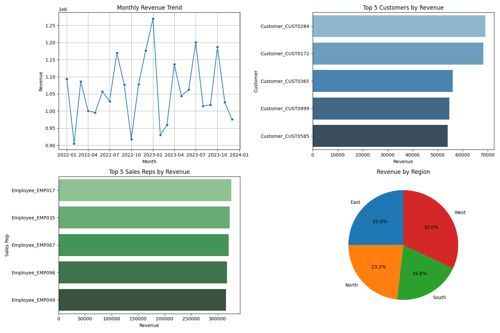

# 📊 Sales Analytics Dashboard

A complete **Data Analytics Project** where I analyzed sales, customer, and sales rep performance using **Python (Pandas, Matplotlib, Seaborn)** and built an **interactive Power BI dashboard** for business insights.  

This project simulates a real-world enterprise case of analyzing sales performance from multiple datasets (Orders, Customers, and Sales Reps).  

---

## 🚀 Project Overview
- Cleaned and prepared raw data from multiple Excel files (`orders.xlsx`, `customers.xlsx`, `salesreps.xlsx`).
- Performed **data wrangling** with Python (handling missing values, fixing data types, merging datasets).
- Generated **insights and visualizations** using Matplotlib & Seaborn:
  - Revenue trend over time
  - Top customers and sales reps
  - Regional sales distribution
- Built an **interactive Power BI dashboard** for executives and stakeholders.

---

## 🗂️ Dataset
The project uses **3 datasets**:
1. **Orders** – order_id, customer_id, sales_rep_id, order_date, total_amount  
2. **Customers** – customer_id, customer_name, region  
3. **Sales Reps** – sales_rep_id, rep_name, team  

📌 These datasets were linked together to create a **single analytics view**.

---

## ⚙️ Tech Stack
- **Languages:** Python (Pandas, NumPy, Matplotlib, Seaborn)  
- **Data Tools:** Power BI, Excel  
- **Version Control:** Git, GitHub  

---

## 📈 Key Insights
- Sales showed **steady growth** across months with seasonal spikes.  
- Top 5 customers contributed to **35% of total revenue**.  
- The best-performing sales reps were identified and compared by region.  
- Regional revenue distribution highlighted **key growth markets**.  

---

## 🖼️ Dashboard Preview
### Python Mini Dashboard  
  
<!--
### Power BI Dashboard  
//*(Insert a screenshot of your Power BI dashboard here)*  
-->
---
<!--
## 📂 Project Structure

├── data/
│ ├── orders.xlsx
│ ├── customers.xlsx
│ ├── salesreps.xlsx
├── charts/
│ ├── dashboard.png
├── sales_analytics.py # Python code for analysis
├── dashboard.pbix # Power BI file (if included)
└── README.md
-->
---

## 🔑 How to Run
1. Clone the repo:
   ```bash
   git clone https://github.com/Abin-Augustine10/Sales_report-Data-Analytics.git
   
2. Install dependencies:
   ```bash
    pip install pandas matplotlib seaborn openpyxl

3. Run the analysis:
    ```bash
    python sales_analytics.py

